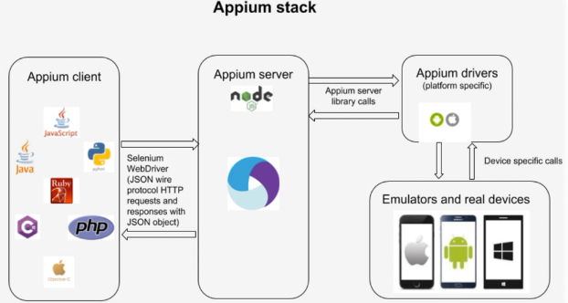

# Appium Nasıl Çalışır? (Appium Stack / Mimari Yapı)

Bu doküman, Appium’un test komutlarını cihazda nasıl çalıştırdığını ve arka plandaki mimari katmanları
(“Appium Stack”) adım adım anlamak için hazırlanmıştır.

---

## 1) Appium Ne Yapar?
Appium, test kodun ile (Java/JS/Python vs.) mobil cihaz/emülatör arasında bir **köprü** gibi çalışır.

Sen testte “Login butonuna tıkla” dediğinde:
- Test kodu bunu bir “komut”a çevirir
- Bu komut Appium Server’a gider
- Appium Server komutu cihaz tarafındaki otomasyon motoruna iletir
- Cihaz o işlemi uygular ve sonucu geri döndürür

Bu sayede testler, gerçek kullanıcı davranışına benzer şekilde çalıştırılır.

---

## 2) Temel Kavramlar (Kısa Tanımlar)

###  Appium Client (İstemci)
Test kodunu yazdığın kütüphanedir.
Örn: `Appium Java Client`, `WebdriverIO`, `Appium Python Client`.

- Test senaryolarını yazarsın
- Driver oluşturursun
- Element bulma ve aksiyon komutlarını buradan gönderirsin

---

###  Driver (Sürücü)
Test kodunun uygulamayı kontrol etmek için kullandığı ana nesnedir.

Örnek fikir:
- Driver = “uzaktan kumanda”
- Element = “kumandadaki tuşlar”
- Komutlar = “tıklama, yazma, swipe”

---

###  Capabilities (Oturum Ayarları)
Testin hangi ortamda çalışacağını Appium’a anlatan ayarlardır.

Örnek bilgi türleri:
- Platform (Android / iOS)
- Cihaz adı
- OS versiyonu
- Test edilecek uygulama (app / appPackage / appActivity vb.)
- Otomasyon motoru (Android’de genelde `UiAutomator2`)

Capabilities gönderilmeden Appium, “hangi cihaz?” “hangi uygulama?” sorularını bilemez.

---

###  Appium Server
Appium’un kalbidir. Genellikle bilgisayarında (localhost) çalışır.

Görevleri:
- Client’tan gelen komutları almak
- Doğru driver’a yönlendirmek
- Cihazla haberleşmek
- Sonuçları test koduna geri döndürmek

> Appium Server “komut merkezi” gibidir.

---

## 3) Appium Nasıl Çalışır? (Adım Adım Akış)

Aşağıdaki akış, Appium’un çalışma mantığını netleştirir:

### 1️⃣ Test Başlar
Sen test framework’ünü çalıştırırsın (JUnit/TestNG/Jest/Mocha vs).

### 2️⃣ Driver Oluşturulur (Session Açılır)
Test kodu Appium Server’a bir istek gönderir:
- “Şu capabilities ile bir session başlat”

Bu isteğe “New Session Request” denir.

### 3️⃣ Appium Server Capabilities’i Okur
Server gelen ayarlara göre:
- Android mi iOS mu?
- Emulator mü real device mı?
- Hangi otomasyon motoru kullanılacak?

karar verir.

### 4️⃣ Cihaz Tarafında Otomasyon Motoru Çalışır
- Android tarafında en yaygın: **UiAutomator2**
- iOS tarafında en yaygın: **XCUITest**

Bu motorlar cihaz üstünde elementleri bulur ve aksiyonları uygular.

### 5️⃣ Test Komutları Gönderilir
Örn:
- “Bu elemente tıkla”
- “Şu alana yaz”
- “Swipe yap”

Bu komutlar:
Test Kodu → Appium Client → Appium Server → Cihaz Otomasyon Motoru
şeklinde ilerler.

### 6️⃣ Sonuç Geri Döner
Komut başarılı/başarısız bilgisi ve varsa hata mesajı geri döner.
Test de buna göre “Passed/Failed” olur.

---

## 4) Appium Stack (Mimari Yapı) — Katmanlar

Appium Stack’i en anlaşılır şekilde katman katman düşün:

### Katman 1: Test Kodu
- Senaryoları yazdığın katman
- Assertion / doğrulamalar burada yapılır
- Örn: “Login sonrası ana sayfa açıldı mı?”

### Katman 2: Appium Client Library
- `findElement`, `click`, `sendKeys` gibi komutları sağlar
- Komutları **WebDriver protokolüne uygun** isteklere dönüştürür

### Katman 3: WebDriver Protokolü (W3C WebDriver)
Appium, komutları genellikle WebDriver mantığıyla taşır.
Bu, “standart bir komut dili” gibi düşünülebilir.

> Bu yüzden Appium testleri “uzaktan komut gönderme” mantığıyla çalışır.

### Katman 4: Appium Server
- İstekleri karşılar (HTTP üzerinden)
- Platforma göre doğru driver’ı seçer
- Komutu cihaz tarafına iletir

### Katman 5: Platform Driver
Appium Server içinde platforma göre seçilen driver vardır.

Örnek:
- Android → `UiAutomator2 Driver`
- iOS → `XCUITest Driver`

Bu driver “platform çevirmeni” gibidir:
WebDriver komutunu alır → cihazın anlayacağı komuta çevirir.

### Katman 6: Cihaz Otomasyon Motoru
- Android: UiAutomator2
- iOS: XCUITest

Burada gerçek aksiyonlar çalışır:
- element bulma
- tıklama
- swipe
- klavye ile yazma

### Katman 7: Uygulama (AUT - Application Under Test)
Test edilen uygulamanın kendisi.
Appium burada uygulamayı kullanıcı gibi yönetir.

---

## 5) Appium Inspector Bu Mimaride Nereye Oturur?
**Appium Inspector**, test yazmadan önce elementleri keşfetmek için kullanılır.

Mantık aynı:
- Inspector da Appium Server’a bağlanır
- Session açar (capabilities ile)
- Uygulama ekranını görür
- Elementleri seçip locator üretir

Yani Inspector, test kodunun yerine geçen bir “keşif aracı”dır.

---

## 6) Neden Bazı Testler Yavaş/İstikrarsız Olabilir?
Appium’un mimarisi “uzaktan komut gönderme” üzerine kurulu olduğu için:
- Her adım network/HTTP çağrısı gibi düşünebilir
- Cihaz çeşitliliği (farklı marka/sürüm) stabiliteyi etkileyebilir
- Element bulma stratejileri (özellikle kötü XPath) testleri yavaşlatabilir

Bu yüzden Appium’da:
- doğru locator seçimi
- wait stratejileri
- stabil test tasarımı

çok kritiktir.

---

## Özet
- Test kodu komut üretir
- Appium Client komutu WebDriver isteğine çevirir
- Appium Server bu isteği alır
- Platform driver komutu cihaz motoruna iletir
- Cihaz motoru (UiAutomator2 / XCUITest) aksiyonu uygular
- Sonuç test koduna geri döner

