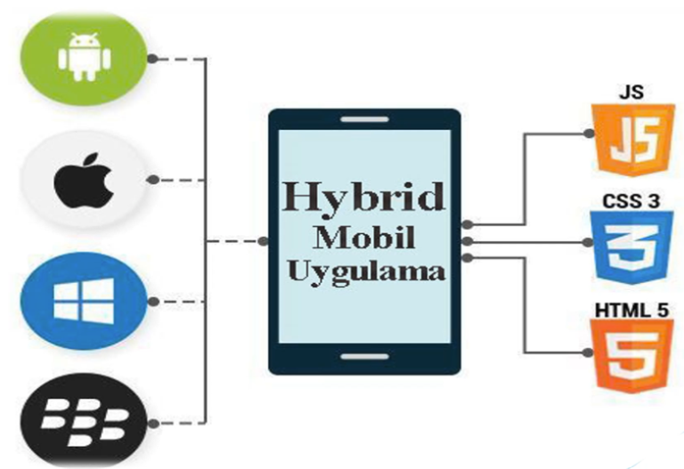

# Mobil Uygulama Türlerine Genel Bakış

Mobil test otomasyonu konusunu doğru anlayabilmek için, öncelikle **test ettiğimiz uygulama türlerini**
net bir şekilde bilmemiz gerekir.

**Appium**; yerel (native), web ve hibrit uygulamaları test edebilen, platformlar arası çalışan güçlü
bir mobil test otomasyon aracıdır.

Genel olarak mobil uygulamalar **üç ana başlık** altında incelenir:

- Yerel (Native) Mobil Uygulamalar
- Web (Mobil Web) Uygulamaları
- Hibrit (Hybrid) Mobil Uygulamalar

---

## 1️⃣ Yerel (Native) Mobil Uygulamalar

Yerel mobil uygulamalar, **doğrudan işletim sistemine özgü** geliştirilmiş uygulamalardır.

###  Kullanılan Teknolojiler
- **Android**: Java / Kotlin
- **iOS**: Swift / Objective-C

###  Temel Özellikler
- Cihaza kurulmadan çalıştırılamaz
- Donanım özelliklerine (kamera, GPS, sensörler vb.) **doğrudan erişebilir**
- Performans açısından **en güçlü** uygulama türüdür

###  Örnekler
- WhatsApp  
- Instagram  
- Kamera uygulaması  

###  Appium ile Test
Appium, native uygulamaları **doğrudan UI elementleri** üzerinden test edebilir.
Yani kullanıcı ekranda ne görüyorsa, Appium da o elementlerle birebir etkileşime girer.

---

## 2️⃣ Web (Mobil Web) Uygulamaları

Mobil web uygulamaları, herhangi bir mobil tarayıcı (Chrome, Safari vb.) üzerinden erişilen
uygulamalardır.

###  Temel Özellikler
- Cihaza kurulum gerekmez
- Sadece bir **URL** üzerinden çalışır
- **HTML, CSS ve JavaScript** ile geliştirilir

###  Örnekler
- Mobil e-ticaret siteleri
- Web tabanlı formlar
- Kurumsal web sayfalarının mobil sürümleri

###  Appium ile Test
Appium, mobil web uygulamalarını **tarayıcı üzerinden** test eder.  
Bu test yaklaşımı, mantık olarak **Selenium WebDriver** kullanımına oldukça benzer.

---

## 3️⃣ Hibrit (Hybrid) Mobil Uygulamalar

Hibrit mobil uygulamalar, **native ve web uygulamaların birleşimi** olarak düşünülebilir.

###  Temel Yapı
- Cihaza **native uygulama gibi yüklenir**
- İçerisinde bir veya birden fazla **WebView** barındırır
- Web teknolojileri (HTML, CSS, JavaScript) ile geliştirilir

Native bir kabuk + Web içeriği = Hibrit uygulama

##  Örnekler

- E-ticaret uygulamaları  
- Bankacılık uygulamaları  
- Kurumsal mobil uygulamalar  

---

##  Hibrit Uygulamaların Avantajı

Hibrit yaklaşımın temel amacı şudur:

> **“Bir kez kod yaz, birden fazla platformda çalıştır.”**

Bu yaklaşım sayesinde:

- Aynı kod tabanı ile **Android ve iOS** için uygulama geliştirilebilir
- Güncelleme ve bakım maliyeti düşer
- Uygulamalar **App Store** ve **Google Play** üzerinden dağıtılabilir

Bu nedenle hibrit uygulamalar günümüzde oldukça yaygın olarak tercih edilmektedir.

---

##  Appium ve Hibrit Uygulamalar

Appium, hibrit uygulamaları test ederken önemli bir yetenek sunar:

- Native ekranlar ile **WebView içerikleri** arasında **context switch** yapabilir
- Hem native elementleri hem de web elementlerini test edebilir

Bu özellik, Appium’u **hibrit uygulama testlerinde çok güçlü ve esnek** bir araç haline getirir.

---

## Not

Mobil uygulama türlerini net bir şekilde ayırt edebilmek;

- Doğru test stratejisini seçmeyi
- Doğru locator yaklaşımını kullanmayı
- Appium testlerinde yaşanan sorunları daha hızlı analiz etmeyi

sağlar.
