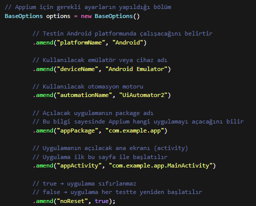

# appPackage ve appActivity Nedir?

Bu dokümanda Appium testlerinde kullanılan **appPackage** ve **appActivity** kavramları açıklanmıştır.

---

## 1) appPackage Nedir?

`appPackage`, Android uygulamasının **benzersiz paket adıdır**.  
Her Android uygulamasının sistem içinde tek bir package ismi vardır.

### Örnek

com.instagram.android
com.whatsapp
com.google.android.youtube

Appium, hangi uygulamayı açacağını appPackage bilgisi sayesinde bilir.

---

## 2) appActivity Nedir?

`appActivity`, uygulama açıldığında çalışan **ana ekran sınıfıdır**.

Yani uygulamanın ilk açılan sayfasını temsil eder.

### Örnek

com.instagram.mainactivity.MainActivity
com.whatsapp.HomeActivity
com.google.android.apps.youtube.app.WatchWhileActivity

Appium, uygulamayı başlatırken bu ekranı kullanır.

---

## 3) appPackage ve appActivity Nasıl Bulunur?

### Yöntem 1: Appium Inspector (Önerilen)

1. Appium Server çalıştırılır  
2. Appium Inspector açılır  
3. Uygulama başlatılır  
4. Desired Capabilities ekranında otomatik görünür  

---

### Yöntem 2: ADB Komutu ile Bulma

Terminal / CMD açılır ve şu komut yazılır:

adb shell dumpsys window | grep -E "mCurrentFocus"

Çıktı örneği:

com.instagram.android/com.instagram.mainactivity.MainActivity

Burada:

com.instagram.android → appPackage

com.instagram.mainactivity.MainActivity → appActivity

---

## 4) Appium’da Kullanımı (Örnek Kod)

Aşağıda appPackage ve appActivity kullanılan örnek bir yapı bulunmaktadır.

---

## 5) Sık Yapılan Hatalar

### ❌ Yanlış appPackage

- Uygulama açılmaz  
- "App not found" hatası alınır  

---

### ❌ Yanlış appActivity

- Uygulama splash ekranında kalır  
- Ana sayfa açılmaz  

---

### ❌ noReset Yanlış Kullanımı

- `false` → Her testte login tekrar ister  
- `true` → Oturum korunur  

---

## 6) Özet

- `appPackage` → Uygulamanın kimliği  
- `appActivity` → Açılan ilk ekran  
- Doğru girilmezse test çalışmaz  
- Appium Inspector ile bulmak en güvenli yöntemdir  

---

✅ Bu bilgiler mobil test otomasyonunun temelini oluşturur.