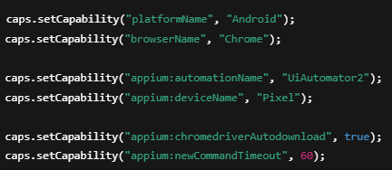

# Mobile Browser Testing (Appium 2 + Chrome)

Bu doküman, Android cihazlarda Appium kullanarak
Chrome tarayıcısı üzerinden web sitelerinin
nasıl otomatik olarak test edileceğini
adım adım açıklar.

---

##  Bu Çalışmanın Amacı

Bu çalışmanın amacı:

- Mobil cihazlarda web testlerinin nasıl yapıldığını öğrenmek
- Appium 2 ile tarayıcı otomasyonuna giriş yapmak
- Chromedriver yönetimini otomatik hale getirmek
- Gerçek cihaz veya emulator üzerinde test çalıştırmak

---

##  Mobile Browser Testing Nedir?

Mobile Browser Testing, mobil cihazlarda
Chrome gibi tarayıcılar üzerinden
web uygulamalarının test edilmesidir.

Bu yöntem sayesinde:

- Mobil uyumluluk test edilir
- Responsive tasarımlar kontrol edilir
- Gerçek kullanıcı senaryoları simüle edilir

---

##  Kullanılan Teknolojiler

Bu çalışmada aşağıdaki teknolojiler kullanılmıştır:

- Java (Programlama dili)
- Appium 2 (Mobil otomasyon aracı)
- Selenium WebDriver (Web etkileşimleri)
- TestNG (Test framework)
- Maven (Proje yönetimi)
- Android Emulator / Gerçek Cihaz

---

##  Ön Gereksinimler

Testlere başlamadan önce sistemde:

- Appium Server çalışıyor olmalıdır
- Android emulator veya telefon bağlı olmalıdır
- Cihaz `adb devices` komutu ile görünmelidir
- Chrome uygulaması yüklü olmalıdır
- Java ve Maven kurulu olmalıdır

---

##  Sistem Kontrolü

Testlere başlamadan önce cihaz ve Appium servisinin
aktif olduğunu kontrol etmek gerekir.

Aşağıdaki komutlar kullanılabilir:

adb devices
appium

---

## Capability Kavramı

Appium’da test başlatılmadan önce,
hangi cihazda ve hangi ortamda çalışılacağını
belirleyen ayarlara capability denir.

Capability’ler sayesinde:

Hangi platformda çalışılacağı

Hangi tarayıcının açılacağı

Hangi otomasyon motorunun kullanılacağı

belirlenmiş olur.

---

## Kullanılan Capability Ayarları

Bu projede kullanılan temel capability ayarları
aşağıda gösterilmiştir:

---

###  Capability Açıklamaları

Aşağıdaki tabloda kullanılan capability ayarları
ve görevleri açıklanmıştır:

| Ayar | Açıklama |
|------|----------|
| platformName | İşletim sistemi |
| browserName | Kullanılan tarayıcı |
| automationName | Appium otomasyon motoru |
| deviceName | Cihaz adı |
| chromedriverAutodownload | Otomatik driver indirme |
| newCommandTimeout | Zaman aşımı süresi |

---

##  Test Senaryosu Nasıl Çalışır?

Bu test aşağıdaki adımlarla çalışır:

1. Appium Server ile bağlantı kurulur  
2. Chrome tarayıcı başlatılır  
3. Belirtilen web sitesi açılır  
4. Sayfadaki ilgili element bulunur  
5. Doğrulama (assertion) yapılır  
6. Test sonucu raporlanır  

Bu yapı, gerçek kullanıcı davranışını
simüle etmeyi amaçlamaktadır.

---

##  Örnek Test Kodu

Aşağıda örnek bir mobil browser test kodu yer almaktadır:

driver.get("https://www.amazon.com.tr");

WebElement logo =
driver.findElement(By.xpath("//a[@id='nav-logo-sprites']"));

Assert.assertTrue(logo.isDisplayed());

Bu kodun yaptığı işlemler:

Web sitesine gider

Sayfadaki logoyu bulur

Logonun görünür olup olmadığını kontrol eder

---

## Testleri Çalıştırma

mvn test

IntelliJ ile

1.Test dosyasına sağ tıkla

2.Run seçeneğini seç

3.Yeşil Play butonuna bas

---

##  Karşılaşılabilecek Problemler

###  Cihaz Algılanmıyorsa

Aşağıdaki komut ile cihaz bağlantısını kontrol et:

adb devices

Eğer liste boşsa:

- USB Debugging açık mı kontrol et  
- Emulator çalışıyor mu kontrol et  
- USB kablosu ve bağlantıyı kontrol et  

---

###  Tarayıcı Açılmıyorsa

Eğer Chrome tarayıcı açılmıyorsa:

- Chrome uygulamasının güncel olup olmadığını kontrol et  
- Appium Server’ı yeniden başlat  
- Chromedriver plugin aktif mi kontrol et  

Gerekirse:

appium plugin install chromedriver
appium --use-plugins=chromedriver

---

## Sonuç

Bu çalışma ile:

- Mobil web testlerinin temelleri öğrenilmiştir  
- Appium 2 ile güncel otomasyon yapısı kurulmuştur  
- Chromedriver yönetimi otomatik hale getirilmiştir  
- Gerçek cihaz üzerinde test pratiği yapılmıştır  

