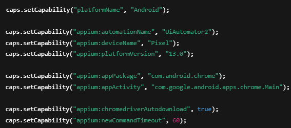
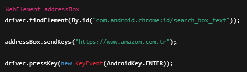

#  Chrome Mobile App Testing (Appium 2)

Bu doküman, Android cihazlarda Chrome uygulamasının
native olarak açılarak web sitelerinin
Appium ile otomatik test edilmesini açıklar.

Bu yöntemde tarayıcı, uygulama gibi
appPackage ve appActivity kullanılarak başlatılır.

---

## Amaç

- Chrome uygulamasını native olarak açmayı öğrenmek  
- appPackage ve appActivity kavramlarını anlamak  
- Native ve Web testlerini birlikte kullanmak  
- Mobil tarayıcı otomasyonu geliştirmek  

---

##  Chrome App Testing Nedir?

Chrome App Testing, mobil cihazlarda
Chrome uygulamasının doğrudan açılarak
web testlerinin gerçekleştirilmesidir.

Bu yöntem sayesinde:

- Uygulama seviyesinde test yapılır  
- Gerçek kullanıcı davranışı simüle edilir  
- Hybrid test yapıları desteklenir  

---

##  Kullanılan Teknolojiler

- Java  
- Appium 2  
- Selenium WebDriver  
- TestNG  
- Maven  
- Android Emulator / Real Device  

---

##  Ön Gereksinimler

Testlerden önce:

- Appium Server çalışıyor olmalı  
- Android cihaz bağlı olmalı  
- Chrome uygulaması yüklü ve güncel olmalı  
- Cihaz `adb devices` ile görünmeli  

Kontrol için:

adb devices
appium

---

## appPackage ve appActivity Kavramı

Chrome uygulamasını açabilmek için,
Android uygulamasına ait iki temel bilgi kullanılır.

---

###  appPackage

`appPackage`, uygulamanın sistemdeki
benzersiz kimliğini ifade eder.

**Örnek:**

com.android.chrome

---

###  appActivity

`appActivity`, uygulamanın açılış ekranını
temsil eder.

**Örnek:**

com.google.android.apps.chrome.Main

Bu bilgiler genellikle Appium Inspector
veya adb komutları kullanılarak bulunur.

---

## Kullanılan Capability Ayarları

---

## Test Senaryosu Nasıl Çalışır?

Bu test aşağıdaki adımlarla çalışır:

1.Appium Server ile bağlantı kurulur

2.Chrome uygulaması açılır

3.Adres çubuğuna URL yazılır

4.Enter tuşu gönderilir

5.Web sayfası açılır

6.Sayfa doğrulanır

---

## Örnek Test Kodu

---

## Testleri Çalıştırma

Maven ile
mvn test

IntelliJ ile

-Test dosyasına sağ tıkla

-Run seçeneğini seç

-Play butonuna bas

---

##  Karşılaşılabilecek Problemler

###  Chrome Açılmıyorsa

Eğer Chrome uygulaması açılmıyorsa:

- appPackage ve appActivity değerlerinin doğru olup olmadığını kontrol et  
- Chrome uygulamasının güncel olup olmadığını kontrol et  
- Appium Server’ı yeniden başlat  

---

###  Web Sayfası Açılmıyorsa

Eğer web sayfası açılmıyorsa:

- İnternet bağlantısını kontrol et  
- Chromedriver plugin aktif mi kontrol et  
- Appium loglarını incele  

---

##  Sonuç

Bu çalışma ile:

- Chrome uygulaması native olarak kontrol edilmiştir  
- appPackage ve appActivity kullanımı öğrenilmiştir  
- Mobil tarayıcı otomasyonu geliştirilmiştir  
- Gerçek cihaz üzerinde test pratiği kazanılmıştır  

Bu yapı, hybrid ve ileri seviye
mobil test projeleri için güçlü bir temel sağlar.
