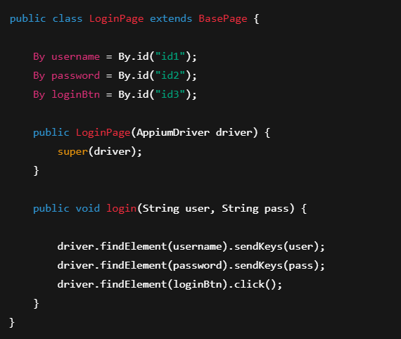

# Bölüm 14 — Page Object Model (POM)

## POM Nedir?
Page Object Model, mobil uygulamadaki her ekran için ayrı bir sınıf
oluşturularak testlerin daha düzenli yazılmasını sağlayan tasarım desenidir.

Her ekran = 1 Page Class

---

## Neden POM Kullanılır?
- Kod tekrarını azaltır
- Bakımı kolaylaştırır
- Testleri okunur yapar
- Projeyi büyütmeye uygundur

---

## Klasör Yapısı

pages/
tests/
base/

- pages → Ekran sınıfları  
- tests → Test sınıfları  
- base → Ortak sınıflar  

---

## BasePage Sınıfı

Tüm page class’ların ortak driver kullandığı sınıftır.

public class BasePage {

    protected AppiumDriver driver;

    public BasePage(AppiumDriver driver) {
        this.driver = driver;
    }
}

---

## Page Class Örneği

---

## Test Class Kullanımı

---

## Best Practices
- Locator’lar page class içinde yazılır  
- Test içinde findElement kullanılmaz  
- Her ekran için ayrı page oluşturulur  
- Action’lar page içinde toplanır  

---

## Yaygın Hatalar
- Tek page class kullanmak  
- Testte locator yazmak  
- Kod tekrarına izin vermek  
- Page yapısını karıştırmak  

---

## Özet

POM kullanımı sayesinde:

- Kod daha temiz olur  
- Testler daha stabil çalışır  
- Proje profesyonel hale gelir  

Mobil test otomasyonunda temel standarttır.
