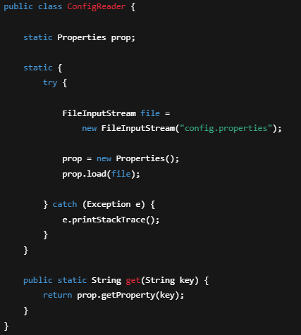
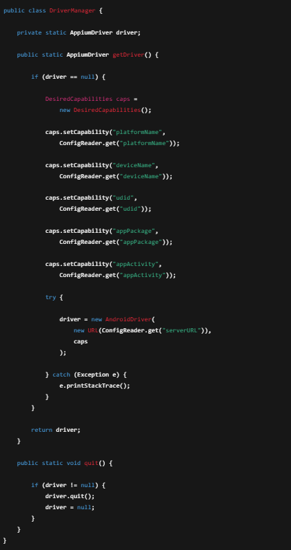
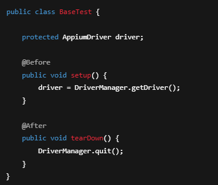

# Bölüm 15 — ConfigReader ve Driver Manager

## Config Nedir?
Config dosyası, test ortamına ait bilgilerin koddan ayrı tutulmasını sağlar.

---

## Neden Kullanılır?
- Ortam değiştiğinde kod değiştirilmez
- Merkezi yönetim sağlar
- Bakımı kolaylaştırır
- Esneklik kazandırır

---

## config.properties

platformName=Android
deviceName=Pixel
udid=emulator-5554
automationName=UiAutomator2
appPackage=com.test.app
appActivity=com.test.Main
serverURL=http://127.0.0.1:4723

---

## ConfigReader

Config dosyasını okuyarak değerleri projede kullanılabilir hale getirir.

---

## Driver Manager Nedir?

AppiumDriver nesnesinin tek merkezden yönetilmesini sağlar.

Singleton yapısı kullanılır.

---

## DriverManager

---

## BaseTest

---

## Best Practices
- Ortam bilgileri config dosyasında tutulur  
- Driver her yerde new edilmez  
- Tek driver yapısı kullanılır  
- quit() metodu unutulmaz  

---

## Yaygın Hatalar
- serverURL yanlış girilmesi  
- config yolu hatası  
- driver null kalması  
- Port çakışması  

---

## Özet

ConfigReader ve DriverManager kullanımı sayesinde:

- Proje daha esnek olur  
- Testler daha stabil çalışır  
- Ortam yönetimi kolaylaşır  

Profesyonel framework’lerin temel yapısıdır.

