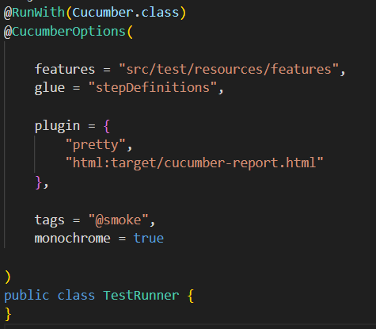
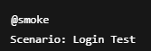
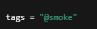

# Bölüm 16 — PrettyReports ve TestRunner

## PrettyReports Nedir?
PrettyReports, test sonuçlarını görsel ve anlaşılır raporlar
halinde sunan raporlama aracıdır.

---

## Neden Kullanılır?
- Test sonuçlarını kolay analiz etmek
- Hataları hızlı görmek
- Rapor paylaşımını kolaylaştırmak
- Profesyonel çıktı almak

---

## PrettyReports Kurulumu

pom.xml dosyasına gerekli bağımlılıklar eklenir.

cucumber-reporting
extent-report

---

## TestRunner Nedir?
TestRunner, Cucumber senaryolarının nasıl ve hangi ayarlarla
çalıştırılacağını belirleyen sınıftır.

---

## TestRunner Yapısı

---

## Plugin Kullanımı

Plugin alanı rapor türlerini belirler.

- pretty → Konsol çıktısı  
- html → HTML rapor  
- json → JSON rapor  
- extent → Detaylı rapor  

---

## Tags Kullanımı

Senaryoları gruplamak için kullanılır.

---

## Test Çalıştırma

Testler TestRunner class üzerinden başlatılır.

- Sağ tık → Run  
- Maven → mvn test  

---

## Best Practices
- Her proje için standart rapor yapısı oluştur  
- Tag kullanımı alışkanlık haline getir  
- Gereksiz plugin kullanma  
- Rapor klasörünü temiz tut  

---

## Yaygın Hatalar
- Yanlış features yolu  
- Glue path hatası  
- Plugin yazım hatası  
- Tag bulunamaması  

---

## Özet

PrettyReports ve TestRunner sayesinde:

- Test sonuçları düzenli tutulur  
- Otomasyon süreci izlenebilir olur  
- Proje daha profesyonel görünür

