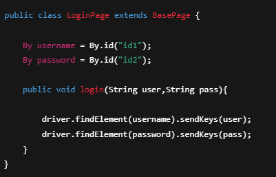
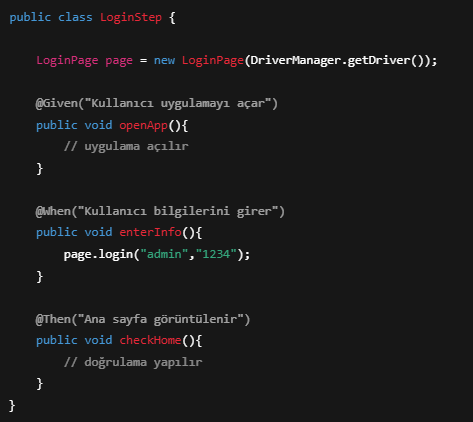

# Bölüm 17 — Pages, Step ve Feature Yapısı

## Feature Nedir?
Feature dosyası, test senaryolarının yazıldığı Cucumber dosyasıdır.

Gherkin dili kullanılır.

---

## Feature Dosyası Yapısı

Feature: Login Testi

  Scenario: Başarılı Giriş

    Given Kullanıcı uygulamayı açar
    When Kullanıcı bilgilerini girer
    Then Ana sayfa görüntülenir

---

## Pages Nedir?

Pages klasörü, uygulamadaki ekranlara ait sınıfların bulunduğu alandır.

Her ekran için ayrı page class oluşturulur.

---

## Page Class Örneği

---

## Step Definition Nedir?

Feature dosyasındaki adımların Java karşılıklarının yazıldığı sınıflardır.

---

## Step Class Örneği

---

## Yapı İlişkisi

Feature → Step → Page → App

---

## Klasör Yapısı

features/
stepDefinitions/
pages/

---

---

## Best Practices
- Feature dosyaları sade yazılır  
- Step içinde business logic olmaz  
- Locator’lar sadece page içinde olur  
- Kod tekrarından kaçınılır  

---

## Yaygın Hatalar
- Step içinde findElement kullanmak  
- Feature çok uzun yazmak  
- Page–Step karışıklığı  
- Tek class kullanmak  

---

## Özet

Pages, Step ve Feature yapısı sayesinde:

- Kod düzenli olur  
- Testler anlaşılır olur  
- Bakım kolaylaşır  

Cucumber tabanlı projelerin temel yapısıdır.

