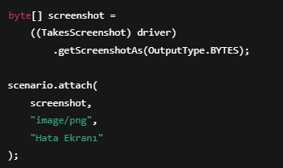

# Bölüm 18 — Hooks Class Kullanımı

## Hooks Nedir?
Hooks, test senaryolarından önce ve sonra çalışan özel metotlardır.

Setup ve Teardown işlemleri için kullanılır.

---

## Neden Kullanılır?
- Testten önce ortam hazırlamak  
- Testten sonra temizlik yapmak  
- Driver yönetimini sağlamak  
- Screenshot almak  

---

## Hooks Class Yapısı

Hooks sınıfı genellikle stepDefinitions altında bulunur.

---

## Before Kullanımı

@Before, her senaryodan önce çalışır.

---

## After Kullanımı

@After, her senaryodan sonra çalışır.

---

## Screenshot Alma

Hata durumunda ekran görüntüsü almak için kullanılır.

---

## Klasör Yapısı

stepDefinitions/
└── Hooks.java

---

## Best Practices
- Driver açma işlemi Hooks içinde yapılır  
- Her senaryo sonunda driver kapatılır  
- Screenshot sadece hata durumunda alınır  
- Hooks sade tutulur  

---

## Yaygın Hatalar
- Driver’ı Hooks dışında yönetmek  
- quit() unutmak  
- Gereksiz screenshot almak  
- Aynı işlemi test içinde tekrar etmek  

---

## Özet

Hooks kullanımı sayesinde:

- Testler daha stabil çalışır  
- Ortam yönetimi kolaylaşır  
- Hata takibi kolaylaşır  

Cucumber projelerinde temel yapıdır.

