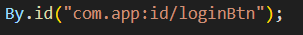
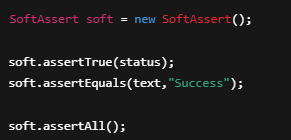

# Bölüm 19 — Locate ve Assertion

## Locate Nedir?
Locate, mobil uygulamadaki elementleri bulmak için kullanılan yöntemdir.

Testlerin doğru çalışması için en önemli adımdır.

---

## Neden Önemlidir?
- Yanlış locator testin fail olmasına neden olur  
- Stabil testler için doğru locate gerekir  
- Bakımı kolaylaştırır  

---

## Locator Türleri

### id
En güvenilir locator türüdür.

---

### accessibilityId

Erişilebilirlik etiketi üzerinden locate eder.

By.accessibilityId("login_button");

---

### className

Elementin sınıf adına göre bulunur.

By.className("android.widget.TextView");

---

### xpath

Hiyerarşik yapı üzerinden locate eder.

By.xpath("//android.widget.TextView[@text='Login']");

---

## Locator Öncelik Sırası

id → accessibilityId → className → xpath

---

## Assertion Nedir?

Assertion, test sonucunun doğru olup olmadığını kontrol eder.

Beklenen sonuç ile gerçek sonuç karşılaştırılır.

---

## Assert Türleri

### AssertEquals
Assert.assertEquals(actual, expected);

---

### AssertTrue
Assert.assertTrue(element.isDisplayed());

---

### AssertFalse
Assert.assertFalse(element.isEnabled());

---

### Soft Assert

Testi durdurmadan kontrol yapmayı sağlar.

---

## Best Practices
- Öncelik id ve accessibilityId olmalı  
- Dynamic xpath kullanmaktan kaçınılmalı  
- Assertion mutlaka yapılmalı  
- SoftAssert dikkatli kullanılmalı  

---

## Yaygın Hatalar
- Uzun ve karmaşık xpath yazmak  
- Hardcoded text kullanmak  
- Assertion eklememek  
- Yanlış expected değer kullanmak  

---

## Özet

Locate ve Assertion sayesinde:

- Testler güvenilir olur  
- Hatalar erken yakalanır  
- Otomasyon kalitesi artar  

Mobil testin temel yapı taşlarıdır.
