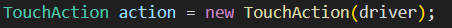
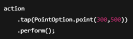
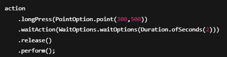
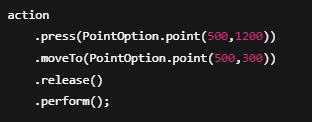
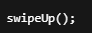

# Bölüm 20 — TouchAction ve Reporting

## TouchAction Nedir?
TouchAction, mobil uygulamada dokunma ve kaydırma gibi  
kullanıcı hareketlerini otomatikleştirmek için kullanılır.

---

## Neden Kullanılır?
- Scroll işlemleri yapmak  
- Swipe hareketlerini gerçekleştirmek  
- Uzun basma işlemleri  
- Gesture kontrolleri  

---

## TouchAction Kurulumu

TouchAction sınıfı Appium tarafından sağlanır.

---

## Tap (Dokunma)

---

## Long Press (Uzun Basma)

---

## Swipe (Kaydırma)

---

## Scroll (Kaydırma)

Scroll işlemi genellikle swipe ile yapılır.

---

## Reporting Nedir?

Reporting, test sonuçlarının raporlanması işlemidir.

---

## Neden Raporlama Yapılır?
- Test sonuçlarını takip etmek  
- Hataları analiz etmek  
- Yönetim raporları oluşturmak  
- Proje kalitesini ölçmek  

---

## Rapor Türleri
- Cucumber HTML Report  
- Extent Report  
- Allure Report  

---

## Rapor Oluşturma

Testler tamamlandıktan sonra otomatik olarak üretilir.

target/
 └── reports/

---

## Best Practices
- Gesture işlemleri reusable yapılmalı  
- Sabit koordinattan kaçınılmalı  
- Raporlar her koşumdan sonra kontrol edilmeli  
- Rapor klasörü temiz tutulmalı  

---

## Yaygın Hatalar
- Yanlış koordinat kullanmak  
- Wait eklememek  
- Rapor oluşturmamak  
- Eski raporları silmemek  

---

## Özet

TouchAction ve Reporting sayesinde:

- Gerçek kullanıcı davranışı simüle edilir  
- Test sonuçları izlenebilir olur  
- Otomasyon süreci profesyonelleşir  

